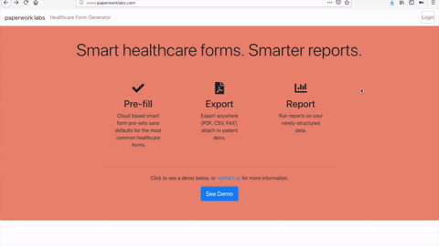

# Paperworklabs – Turbotax for common medical forms

Tech demo for a react app with Node backend to pre-fill most common medical forms with sane defaults, as a service.

Demo on [Heroku Deployed Web App](https://paperworklabs.herokuapp.com/forms)

Screenshots:

 

## Quick Start

    # Install Node dependencies
    npm install

    # Install React dependencies
    npm install --client

    # Start development server
    npm run dev

    # To set up local databases, run
    ./setupdb.sh

## Deploying to HIPAA compliant Elastic Beanstalk with Docker:

    docker build -t paperworklabs .
    docker run -d -p 8080:8080 --name paperworklabs paperworklabs
    ./deploy.sh
    

## To deploy on Heroku Dev:

Set up a new app

	./deploy.sh

Push to heroku git – the postbuild script (see package.json) will take care of the rest.